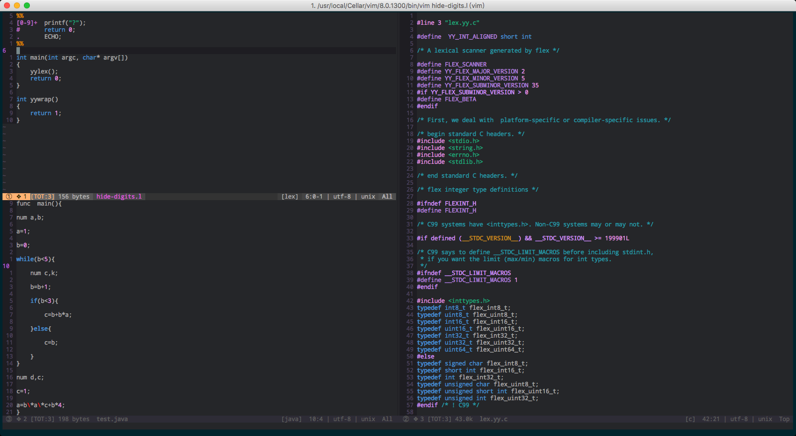

# Vim的分屏功能

目录

[[toc]]

## 示例

## 开启分屏

1. 垂直分屏

   如果当前还没有打开任何文件，执行：`$ vim -On file_1 file_2 ... `

   其中`-On`中`O`是大写字母`O`；`n`是数字，表示分成几屏。

   如果当前已经在Vim中打开了一个文件，则在Vim中执行：`:vsp file_name`

2. 水平分屏

   类似的：`$ vim -on file1 file2 ... `，` o`是小写字母`o`，或`:sp file_name` 

## 调整分屏窗口大小

- 首先按组合键`Ctrl+w`然后按`+`：**增大**光标所在窗口的高度；
- 首先按组合键`Ctrl+w`然后按`-`：**减小**光标所在窗口的高度；
- 首先按组合键`Ctrl+w`然后按`=`：使所有水平分屏窗口的高度相等；

## 关闭分屏

首先按组合键`Ctrl+w`然后按`c`：关闭光标所在窗口的分屏；