# 小白的翻墙之路

[[toc]]

## 部署须知

1. RMB花费：5刀/月
2. 所得流量：1000G/月
3. 服务器端主机系统：Debian 7
4. 节点位置：洛杉矶
5. 测试速度：取决于你的本地网络，我在家测试4k视频的适合没有等待缓冲的现象

## VPS购买与部署

我选择的是[Vultr](https://www.vultr.com/)的VPS，至于各种VPS的比较这里就不介绍了，需要的自行查阅后再选择。假如你不需要了解那么多，希望尽快搭建好开始使用，那么请继续阅读。 

首先到[Vultr官网](https://www.vultr.com/)注册一个账号，然后充值10刀(虽然说每个月5刀，但是人家允许最少充10刀)： 

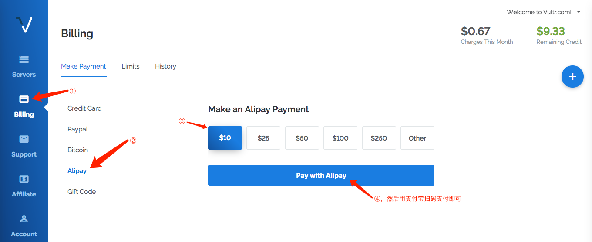

然后部署一台主机： 

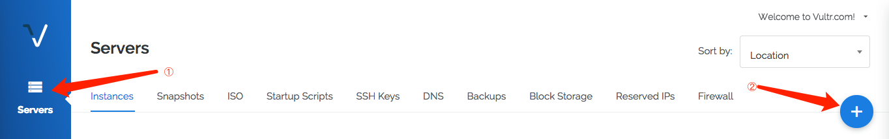

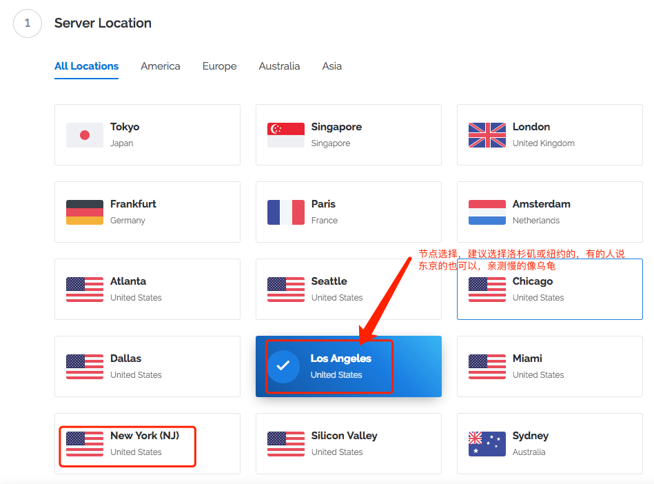

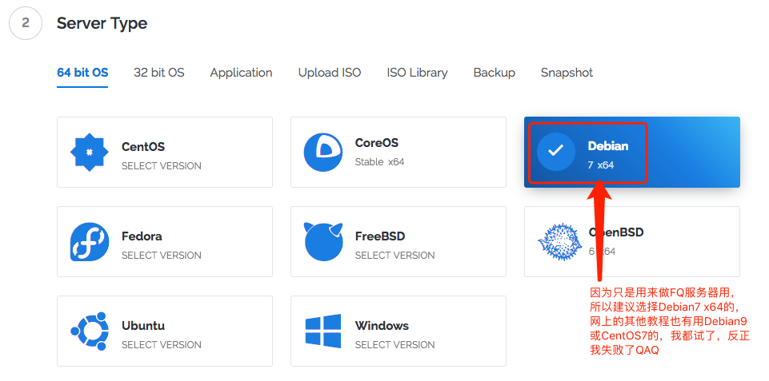

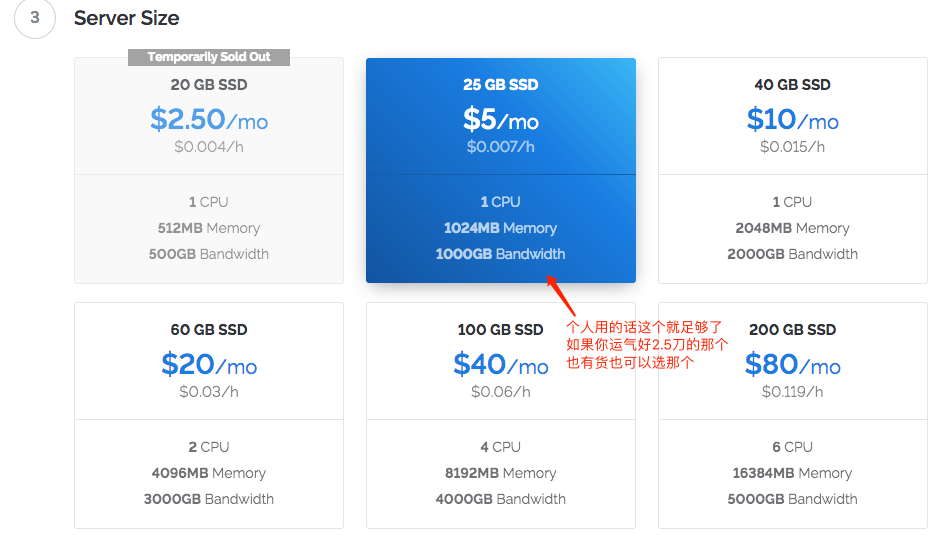

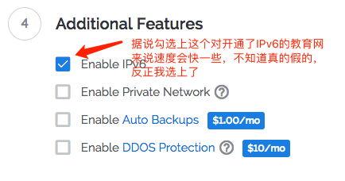

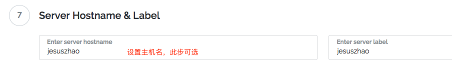

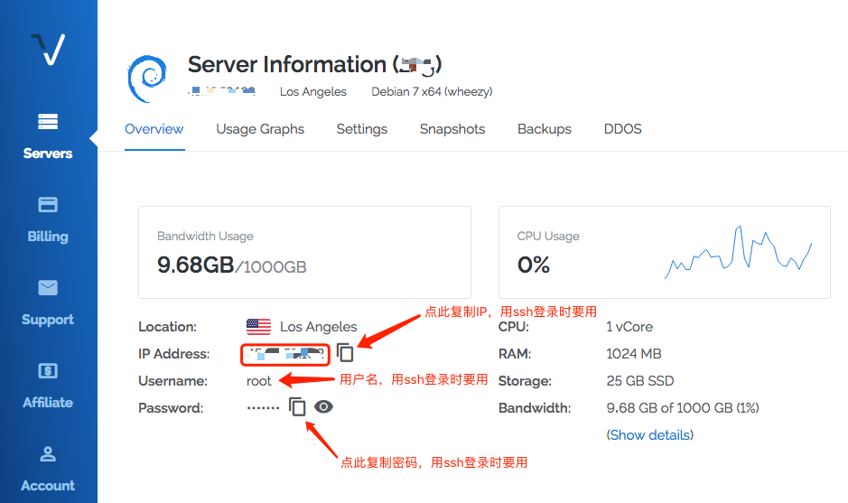

如果你用的是**Windows**，可以使用**puty**登录。[点我去下载](https://www.chiark.greenend.org.uk/~sgtatham/putty/latest.html)，打开puty后只要设置好你的**IP**、用户名**root**和**端口号22**(ssh端口号为22)登录然后输入密码即可。

登录成功显示如下： 

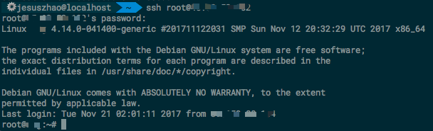

## 服务器端配置

1. 安装SSR：

   ```shell
   $ wget --no-check-certificate	 https://raw.githubusercontent.com/teddysun/shadowsocks_install/master/shadowsocksR.sh
   $ chmod +x shadowsocksR.sh
   $ ./shadowsocksR.sh 2>&1 | tee shadowsocksR.log
   ```

   安装过程中会依次让你输入**密码**(可默认，但不建议)、**登录用的端口号**(可默认，范围1-65535)、**选择加密方式**(建议选择aes-256-cfb)，如果还有其他需要选择的都直接回车默认即可。 

   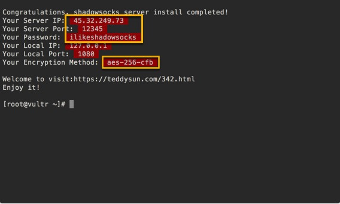

2. 配置 shadowsocks.json 文件

   输入`$ nano /etc/shadowsocks.json`打开文件，然后复制复制如下内容替换文件中的全部内容，然后把**port_password**改成你的即可，可设置多对方便手机电脑都使用： 

   ```json
   {
     "server":"0.0.0.0",
     "server_ipv6":"::",
     "local_address":"127.0.0.1",
     "local_port":1080,
     "port_password":{
         "你的端口号1":"你的密码1，注意后面有逗号",
         "你的端口号2":"你的密码2，注意后面没有逗号"
     },
     "timeout":400,
     "method":"chacha20",
     "protocol": "origin",
     "protocol_param": "",
     "obfs": "plain",
     "obfs_param": "",
     "redirect": "",
     "dns_ipv6": true,
     "fast_open": true,
     "workers": 1
   }
   ```

   保存：Ctrl+x然后输入y，然后回车。

3. 重启SSR：

   ```shell
   $ /etc/init.d/shadowsocks restart
   ```

4. 添加BBR：

   ```shell
   $ wget --no-check-certificate https://github.com/teddysun/across/raw/master/bbr.sh
   $ chmod +x bbr.sh
   $ ./bbr.sh
   ```

   然后会要求你重启服务器，输入**y**回车即可。然后等待大概半分钟重新连接 SSH 验证安装： 

   - 输入`$ uname -r`如果输出中有4.9.0以上就说明安装成功了。输入`$ lsmod | grep bbr`输出中有**tcpbbr**说明BBR已经启动了。 

5. 添加一些优化内容： 

   - 打开sysctl.conf文件：`$ nano /etc/systcl.conf` 

   - 复制如下内容添加到文件最后： 

     ```
     # START MY ADD
     fs.file-max = 51200
     net.core.rmem_max = 67108864
     net.core.wmem_max = 67108864
     net.core.netdev_max_backlog = 250000
     net.core.somaxconn = 4096
     net.ipv4.tcp_syncookies = 1
     net.ipv4.tcp_tw_reuse = 1
     net.ipv4.tcp_tw_recycle = 0
     net.ipv4.tcp_fin_timeout = 30
     net.ipv4.tcp_keepalive_time = 1200
     net.ipv4.ip_local_port_range = 10000 65000
     net.ipv4.tcp_max_syn_backlog = 8192
     net.ipv4.tcp_max_tw_buckets = 5000
     net.ipv4.tcp_fastopen = 3
     net.ipv4.tcp_mem = 25600 51200 102400
     net.ipv4.tcp_rmem = 4096 87380 67108864
     net.ipv4.tcp_wmem = 4096 65536 67108864
     net.ipv4.tcp_mtu_probing = 1
     net.ipv4.tcp_congestion_control = bbr
     #END OF MY ADD
     ```

6. 应用并重启SSR: 

   ```shell
   $ sysctl -p
   输出一些信息...
   $ /etc/init.d/shadowsocks restart
   ```

## VPS安全加固

参考此文：[Jasper的博客：科学上网教程（三）——VPS安全加固](https://jasper-1024.github.io/2017/04/08/VPS%E7%A7%91%E5%AD%A6%E4%B8%8A%E7%BD%91%E6%95%99%E7%A8%8B3/) 

## 客户端配置

在使用客户端的时候会遇到一个选择：自动代理模式OR全局模式？先区别一下吧，方便后面选择：

**自动代理模式**和**全局模式**的区别：按照我目前的理解是，自动代理模式下客户端会自动判断你当前访问的页面是否被墙了，需要FQ的它才会帮你走你的VPS；而全局模式下会将你的所有浏览请求都使用VPS走。按照我的经验是，在一般情况下使用自动代理模式，当某个页面访问过慢或者打不开的时候临时开一下全局模式就好。

- 如果你用的是**Windows**，到这里[下载Shadowsocks](https://github.com/shadowsocks/shadowsocks-windows/releases)，解压后(不用安装)分别设置地址、端口号、加密方式和密码然后确定，最后启动系统代理即可：

  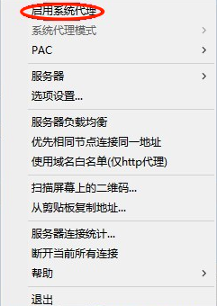

- 如果你用的是**Linux/Mac**，到这里[下载Shadowsocks](https://github.com/shadowsocks/ShadowsocksX-NG/releases)，解压后打开配置如下：

  打开Shadowsocks后依次点击**服务器**➡️**打开服务器设定…**，然后分别设置地址、端口号、加密方式和密码然后确定即可： 

  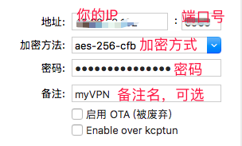

## 验证

[Google](https://www.google.com/)

[YouTube](https://www.youtube.com/)

## 参考文章

[LaiKe的博客](https://33103.ml/2017/11/13/%E7%A7%91%E5%AD%A6%E4%B8%8A%E7%BD%91%E6%95%99%E7%A8%8B%EF%BC%88%E4%B8%80%EF%BC%89%E2%80%94%E2%80%94VPS%E4%B8%8A%E6%90%AD%E5%BB%BASSR/)

[Jasper的博客](https://jasper-1024.github.io/2016/06/26/VPS%E7%A7%91%E5%AD%A6%E4%B8%8A%E7%BD%91%E6%95%99%E7%A8%8B%E7%B3%BB%E5%88%97/)

[Medium的一篇文章](https://medium.com/@zoomyale/%E7%A7%91%E5%AD%A6%E4%B8%8A%E7%BD%91%E7%9A%84%E7%BB%88%E6%9E%81%E5%A7%BF%E5%8A%BF-%E5%9C%A8-vultr-vps-%E4%B8%8A%E6%90%AD%E5%BB%BA-shadowsocks-fd57c807d97e)

::: warning 责任说明
请合法使用相关内容，本文只是出于研究学习与技术分享的目的，其他一切后果与本人无关!
:::
